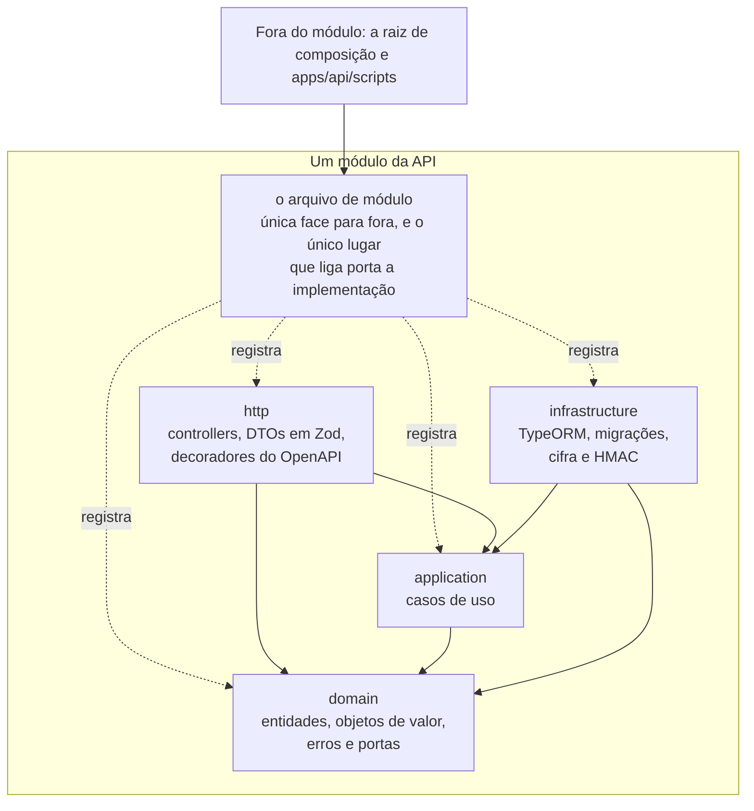
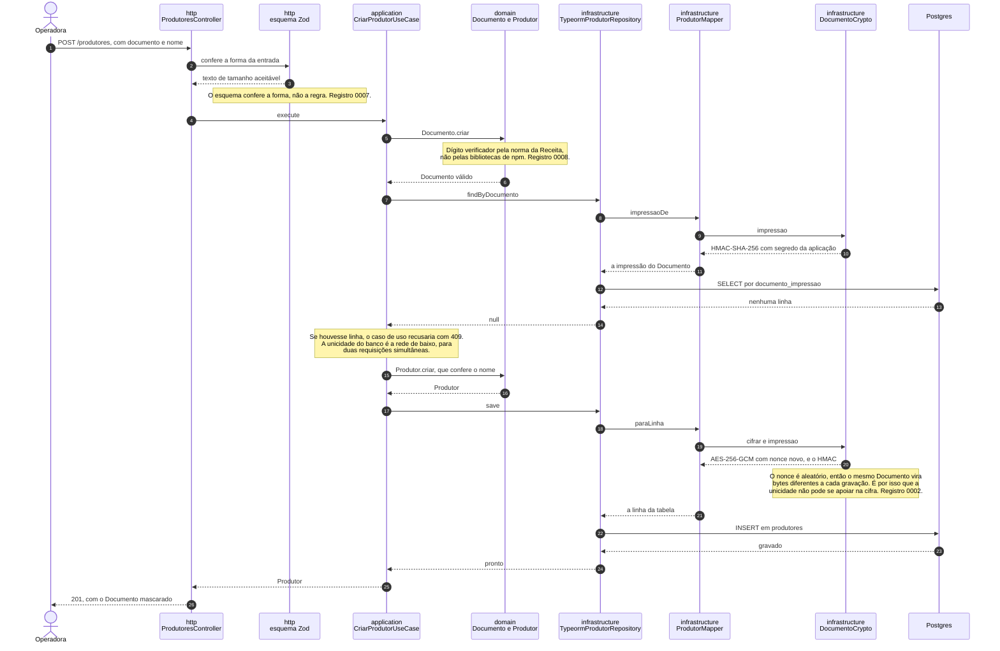

# Cadastro Rural

Cadastro de produtores rurais, das propriedades de cada um e do que cada propriedade
planta em cada safra, com um painel de totais e distribuições. São duas telas, uma API em
NestJS e um Postgres, e tudo sobe com um comando.

O glossário do domínio está em [`CONTEXT.md`](CONTEXT.md), e as decisões difíceis estão em
[`docs/adr`](docs/adr), com uma linha por registro em
[Registros de decisão](#registros-de-decisão).

## No ar

| O quê | Onde |
|---|---|
| Painel e cadastro | https://brain-ag-test.duckdns.org |
| Especificação navegável | https://brain-ag-test.duckdns.org/api/docs |
| Rota de saúde | https://brain-ag-test.duckdns.org/api/health |

O site inteiro pede usuário e senha. O usuário é `brain-user`, e **a senha vai junto com o
link na mensagem de entrega**, nunca aqui: o repositório é público, e uma senha commitada
abriria o cadastro para a internet toda, com poder de apagar Produtor. Trocar a senha do
lado de lá também não custa commit nenhum.

É a mesma versão que está na `main`: cada push nela põe no ar. O runbook está em
[`deploy/README.md`](deploy/README.md). Para rodar na sua máquina, é o comando logo abaixo.

## Subir tudo com um comando

Requisito: Docker com Compose.

```bash
docker compose up --build
```

Sobem três serviços: Postgres 17, a API e a interface web. A API só arranca depois que o
banco aceita conexão. Não é preciso criar `.env`: toda variável tem valor padrão, e
[`.env.example`](.env.example) lista o que dá para trocar.

| Serviço | Endereço |
|---|---|
| Interface web | http://localhost:5173 |
| API | http://localhost:3000 |
| Rota de saúde | http://localhost:3000/health |
| Especificação navegável | http://localhost:3000/docs |

A rota de saúde responde sem tocar em nenhuma tabela do cadastro: ela manda um `SELECT 1`
no banco e mais nada. As migrações rodam no arranque da API, então o banco sobe pronto,
com o catálogo de Culturas já semeado.

## Encher o painel com dados de exemplo

O banco sobe vazio, então o painel abre zerado. Um comando enche o cadastro com um
conjunto pequeno e escolhido a dedo, para que as três distribuições digam algo:

```bash
docker compose exec api pnpm carga:exemplo
```

São 3 Produtores, 5 Propriedades em quatro estados, 10 Plantios de quatro Culturas e 3
Safras. É o mesmo conjunto que o teste de integração do painel confere à mão, então o que
a tela mostra é o que o teste prova.

A carga entra pela API, e não por SQL, de propósito: assim ela percorre a validação do
Documento, a regra da soma das áreas e a cifra em repouso. Um conjunto que só entrasse por
SQL poderia ser um conjunto que a aplicação recusaria, e ninguém descobriria.

Rodar duas vezes não duplica nada: a carga desiste assim que encontra um Produtor
cadastrado, e não sobrescreve o que existe. Para começar do zero, derrube com
`docker compose down --volumes` e suba de novo.

O comando acima usa o `pnpm` da imagem, que o Corepack baixa na primeira execução. Sem
saída para a internet, chame o `ts-node` direto, que já vem na imagem:

```bash
docker compose exec api node_modules/.bin/ts-node --project tsconfig.json scripts/carga-de-exemplo.ts
```

Sem Docker, o comando é `pnpm carga:exemplo` na raiz do repositório, com o Postgres de pé
e as dependências instaladas. Ver [Desenvolver sem Docker](#desenvolver-sem-docker).

## Encher o painel com volume

O conjunto de exemplo cabe numa tela. Para ver o cadastro no tamanho em que ele precisa
responder, e para a [medição do painel](#medição-de-volume-com-o-plano-de-execução) valer
alguma coisa, há uma segunda carga:

```bash
docker compose exec api pnpm carga:volume
```

São 50 Produtores, cerca de 3.000 Propriedades e 100.000 Plantios. A ordem importa: a
carga de exemplo primeiro, a de volume depois. A de exemplo desiste se já houver Produtor
cadastrado, e a de volume desiste se o volume já estiver lá.

Os Produtores entram pela API, como os do exemplo, então o Documento deles é válido e
cifrado em repouso. As Propriedades e os Plantios entram por SQL: cem mil requisições
levariam dezenas de minutos e provariam a validação, que já é provada em outro lugar.

Os dados são sintéticos e assumidos como tais, mas a distribuição não é plana, senão o
painel não mostraria nada. As Propriedades se repartem em escada entre os Produtores, de
três a cem cada um. A cidade e o estado saem de uma lista de localidades reais, com peso
maior onde há mais produção. E cada Propriedade planta um recorte do catálogo, da Cultura
mais comum para a menos comum e da Safra mais recente para a mais antiga, que é o que faz
o gráfico por Cultura ter fatias diferentes e o recorte por Safra mudar o desenho.

Nada aqui sorteia. A mesma carga produz o mesmo cadastro, senão duas medições do painel
não seriam comparáveis.

## As duas telas

O painel fica em `/painel` e mostra o total de Propriedades cadastradas, a soma da Área
Total em hectares, e três distribuições em gráfico de rosca: Propriedades por estado,
Plantios por Cultura e o Uso do Solo. A distribuição por Cultura aceita recorte por Safra.
Cada rosca vem com a legenda dos números ao lado, que é o que um leitor de tela lê.

O cadastro fica em `/cadastro` e se reparte em quatro seções, cada uma com endereço
próprio: `/cadastro/produtores`, `/cadastro/propriedades`, `/cadastro/plantios` e
`/cadastro/catalogos`. Entrar em `/cadastro` sem seção cai em Produtores, porque
Propriedade e Plantio dependem dele para existir.

As três primeiras se encadeiam pela hierarquia do domínio, e o recorte viaja no endereço:
`/cadastro/propriedades?produtor=<id>` são as Propriedades de um Produtor, e
`/cadastro/plantios?propriedade=<id>` são os Plantios de uma Propriedade. Da lista de
Produtores se desce para as Propriedades de cada um, e dali para os Plantios de cada uma.

O navegador nunca chama a porta da API direto. A interface fala com ela pela própria
origem, sob `/api`, e quem repassa é o servidor que entrega a tela: o Caddy no Docker e o
Vite em desenvolvimento. Nas duas pontas o prefixo é cortado, então `/api/painel` chega na
API como `/painel`. As duas telas estão nos registros
[`0009`](docs/adr/0009-interface-web-roteador-grafico-e-mesma-origem.md),
[`0010`](docs/adr/0010-cadastro-em-sub-rotas-com-um-contexto-so.md),
[`0011`](docs/adr/0011-cadastro-navegado-pela-hierarquia.md),
[`0012`](docs/adr/0012-nome-e-contagem-vem-da-api-e-nao-do-catalogo.md) e
[`0013`](docs/adr/0013-propriedade-escolhida-vem-da-api.md).

Nenhum campo é conferido na interface. O Documento inválido, a soma de áreas que não fecha
e o Plantio repetido são recusados pela API, e a tela mostra o texto que ela devolveu, sem
reescrevê-lo.

## Estrutura e as quatro camadas

```
apps/api            API em NestJS
apps/web            interface em React e Vite
packages/contracts  tipos compartilhados entre a API e a web, com o cliente gerado
                    a partir da especificação OpenAPI
```

Cada módulo do domínio da API (`produtores`, `propriedades`, `plantios`, `safras`,
`culturas`, `painel`) se divide em quatro camadas, e as dependências apontam sempre para
dentro.



Três ausências no desenho valem tanto quanto as setas que estão nele. **Nenhuma seta sai
de `domain`**, que é TypeScript puro, sem framework, sem ORM e sem biblioteca de
validação. **`http` nunca alcança `infrastructure`**, e o contrário também não: a porta de
entrada e a porta de saída não se conhecem. E **de fora só se enxerga o arquivo de
módulo**, nunca um arquivo de dentro de uma das quatro camadas.

Entre módulos, só `domain` é território comum. Quando um caso de uso precisa de algo que
vive noutro módulo, declara uma porta no próprio domínio e a infraestrutura de lá a
implementa.

A regra está escrita em três lugares, e a ordem entre eles importa. Este diagrama é o
ilustrativo. A tabela do registro
[`0005`](docs/adr/0005-camadas-isoladas-por-regra-de-dependencia.md) é o legível. E
[`.dependency-cruiser.cjs`](.dependency-cruiser.cjs) é o executável, que roda como portão
da pipeline. Divergência entre os três é defeito, e quem vale é a configuração.

## O cadastro de um Produtor, do pedido à gravação

O caminho de escrita mais completo do sistema, porque é o único que passa por cifra. Ele
atravessa as quatro camadas na ordem que o diagrama acima permite.



A busca por Documento é sempre por igualdade exata sobre a coluna do HMAC, que é
determinística. A coluna cifrada existe para exibição e nunca é critério de busca.

## O Documento

O CPF ou CNPJ de um Produtor é dado pessoal e nunca é gravado em claro. A tabela guarda
duas colunas derivadas dele: o valor cifrado em AES-256-GCM, para exibição, e um HMAC-SHA-256
com segredo da aplicação, que é onde a restrição de unicidade pode existir. A cifra usa
nonce aleatório, então o mesmo Documento vira bytes diferentes a cada gravação, e é por
isso que a unicidade não pode se apoiar nela. A API devolve o Documento sempre mascarado e
o log tem regra de redação para o campo. Ver
[`docs/adr/0002-documento-cifrado-em-repouso.md`](docs/adr/0002-documento-cifrado-em-repouso.md).

A chave e o segredo chegam por variável de ambiente, sem valor padrão no código. A
composição traz valores de desenvolvimento para que um clone recém-feito suba com um
comando. Eles são públicos, e a API recusa arrancar com eles quando `NODE_ENV` é
`production`. [`.env.example`](.env.example) explica como gerar os seus.

A validação segue o código de referência da Receita Federal, não as bibliotecas de npm, e
diverge delas de propósito em dois pontos: um CNPJ com caracteres repetidos é válido, e um
CNPJ pode ter letras maiúsculas nas doze primeiras posições. Ver
[`docs/adr/0008-validacao-de-documento-segue-a-norma-da-receita.md`](docs/adr/0008-validacao-de-documento-segue-a-norma-da-receita.md).

## Autenticação está fora do escopo, por decisão

A API não tem login, não tem sessão, não tem token e não tem controle de acesso. Todos os
endpoints são abertos, e isso é escolha, não esquecimento.

**Por quê.** O enunciado não pede autenticação. Ele pede o cadastro, as regras de validação
de Documento e de soma de áreas, e o painel. Entregar além do que foi pedido aumenta a
superfície de revisão e atrasa o que foi pedido.

A ausência tem uma consequência boa, e é ela que fecha o assunto: não existe o conceito de
"usuário autorizado a ver o Documento completo". A pergunta de como o Documento decifrado
seria exposto, e para quem, deixa de existir, e a API mascara sempre, sem exceção.

**Por onde ela entraria.** Pela camada `http`, como guard e como módulo próprio, sem tocar
em `domain` nem em `application`. Isso não é promessa: a regra de dependência do registro
`0005` já proíbe que regra de negócio dependa da camada de entrada, e a pipeline verifica.
O registro [`0006`](docs/adr/0006-autenticacao-fora-do-escopo.md) é inteiro sobre esta
decisão.

## O catálogo de Cultura

A Cultura vive num catálogo editável, com carga inicial das espécies mais comuns. Além do
nome como a operadora digitou, cada Cultura carrega uma chave de comparação: o nome sem
acento, sem caixa e sem espaço sobrando. É sobre ela que a unicidade é declarada, e é ela
que impede "Café", "cafe" e "CAFÉ" de virarem três linhas do catálogo.

A Safra é identificada por um ano e é compartilhada por todas as Propriedades. Ela não
guarda referência a Propriedade nem a Produtor: quem liga os três é o Plantio.

Os dois saem do cadastro por exclusão, e não por edição: é assim que se conserta um nome
ou um ano digitado errado. A linha que já está em algum Plantio é recusada com 409, pela
chave estrangeira `ON DELETE RESTRICT` — o Plantio é registro do que aconteceu na terra, e
não some porque alguém arrumou o catálogo.

## Bordas transversais

**Log.** Toda requisição sai em JSON com um identificador de correlação. Se a requisição
chegar com o cabeçalho `x-correlation-id`, ele é reaproveitado; senão a API gera um. O
identificador volta no cabeçalho da resposta e aparece em toda linha de log daquela
requisição. O campo `documento` é apagado do log por regra de redação, configurada antes
mesmo de o campo existir.

**Erro.** Toda falha sai no formato Problem Details da
[RFC 9457](https://www.rfc-editor.org/rfc/rfc9457), aplicado por filtro global, com o
tipo de conteúdo `application/problem+json` e o identificador de correlação no corpo.
Erro não previsto vira 500 com detalhe genérico: o rastro fica no log, não na resposta. A
recusa de esquema publica em `erros` o campo recusado e o motivo, um por um, para a
interface apontar o campo no formulário. Toda recusa fala português, inclusive a do
identificador malformado no caminho da rota: a interface mostra o `detail` que a API mandou,
sem reescrita, e texto cru de biblioteca chegaria inteiro à tela. Recusa é logada em `warn`,
e não em `error`:
identificador digitado errado é uso normal, e o nível de erro fica para o que a aplicação
não previu.

## A especificação OpenAPI

A especificação é **versionada**, em [`apps/api/openapi.json`](apps/api/openapi.json). Ela
não é escrita à mão: sai dos decoradores do `@nestjs/swagger` e dos esquemas Zod, por
`pnpm openapi`, que também regera o cliente do pacote de contratos em
`packages/contracts/src/generated`. A interface web consome esse cliente e nunca o código
da API.

Com a composição de pé, a mesma especificação fica navegável em
http://localhost:3000/docs.

O portão que mantém o arquivo em dia é `pnpm openapi:check`: ele regera e reprova se o
resultado sair diferente do que está commitado. Mudar uma rota e esquecer de rodar
`pnpm openapi` reprova a pipeline.

## Desenvolver sem Docker

Requisitos: Node 24 (a versão está em [`.nvmrc`](.nvmrc)) e pnpm, que vem pelo Corepack.

```bash
corepack enable pnpm
pnpm install
cp .env.example .env
pnpm dev
```

O `.env` é obrigatório aqui, ao contrário da composição: a chave de cifra e o segredo da
impressão não têm valor padrão na aplicação, e sem eles a API recusa arrancar. Copiar o
exemplo basta, porque ele já traz os mesmos valores públicos que o `docker-compose.yml`
usa. O arquivo vale na raiz do repositório ou dentro de `apps/api`.

Um Postgres precisa estar de pé. `docker compose up postgres` resolve, ou aponte as
variáveis de `POSTGRES_*` para outro banco.

`pnpm dev` compila o pacote de contratos antes de subir a API e a interface, porque a
interface o importa pelo `dist`. Sem essa compilação a tela sobe em branco.

## Colocar no ar

O sistema sobe numa VPS com os mesmos três containers da composição de desenvolvimento,
puxando as imagens que o CI publica a cada push na `main`. O Caddy que entrega a interface
é o único proxy: termina o TLS, protege tudo com basic auth e repassa `/api`. Publicadas
as imagens, a pipeline entra na VPS por SSH e sobe a versão nova, então push na `main` é
deploy. O runbook, o que ficou de fora e por quê estão em
[`deploy/README.md`](deploy/README.md), e o endereço está em [No ar](#no-ar).

## Como rodar os testes

São três tipos, e **só um deles precisa de Docker**.

| Tipo | Comando | Precisa de Docker |
|---|---|---|
| Unidade, na API | `pnpm --filter @cadastro-rural/api test` | não |
| Unidade, na interface web | `pnpm --filter @cadastro-rural/web test` | não |
| Os dois acima, de uma vez | `pnpm test` | não |
| Os dois acima, com o portão de cobertura | `pnpm test:coverage` | não |
| Integração, borda HTTP | `pnpm --filter @cadastro-rural/api test:integration test/http-edge.int-spec.ts` | não |
| Integração, contra um Postgres de verdade | `pnpm test:integration` | **sim** |

**Unidade.** São 312 testes na API e 146 na interface web. Os da API rodam sem banco, sem
Nest e sem subir aplicação, que é o que torna o laço de TDD rápido. Os da interface usam
Vitest com Testing Library e afirmam o comportamento da tela, incluindo a legenda em texto
que fica ao lado de cada gráfico.

**Integração, sem Docker.**
[`apps/api/test/http-edge.int-spec.ts`](apps/api/test/http-edge.int-spec.ts) sobe a
aplicação Nest em memória, sem banco, e são 11 testes sobre o formato de erro, o
identificador de correlação e a recusa do que chega malformado.

**Integração, com Docker.**
[`apps/api/test/banco.int-spec.ts`](apps/api/test/banco.int-spec.ts) levanta um Postgres
com Testcontainers, e são 5 testes: as migrações e a semeadura, o Documento cifrado que
volta legível sem nenhuma coluna em claro, a unicidade do Documento, a cascata do Plantio,
e o painel agregando no banco. `pnpm test:integration` roda os dois arquivos, então sem
Docker ele reprova no primeiro.

A suíte de contêiner é limitada de propósito a entre três e cinco testes. Ao acrescentar um
caso, tire outro ou junte com um existente: regra de negócio se prova em teste de unidade.

**A composição inteira** também exige Docker, e é conferida na pipeline, que sobe
`postgres` e `api` e espera a rota de saúde responder.

## Medição de volume, com o plano de execução

O painel é o lugar onde volume aparece, e ele agrega **no banco**, nunca em memória. A
medição existe para provar que os índices que o registro
[`0004`](docs/adr/0004-agregacao-do-painel-no-banco.md) mandou criar continuam sendo
usados.

`pnpm medir:painel` abre o painel pela API, pega o SQL que ela executou e manda o Postgres
explicar cada consulta. O relatório completo, com as cinco, está em
[`docs/medicoes/plano-do-painel.md`](docs/medicoes/plano-do-painel.md). Ele não se edita à
mão: a pipeline o regera a cada execução e o publica como artefato, e a cópia versionada só
muda por commit.

A medição transcrita abaixo é de 2026-09-10, contra PostgreSQL 17.11, sobre **100.010
Plantios**, **1.005 Propriedades**, 10 Culturas e 10 Safras, que é o que as duas cargas
produziam naquela data. As cinco consultas do painel responderam entre 0,015 ms e 12,2 ms.
A carga de volume mudou de formato depois disso, e a contagem que vale é sempre a do
relatório gerado, e não a desta linha.

Quatro das cinco consultas agregam sem filtro e leem a base inteira por definição. **O
recorte por Safra é a única em que o índice também descarta linha**, e por isso é a única
que a medição cobra como portão:

```
Sort  (cost=274.82..274.85 rows=10 width=24) (actual time=1.285..1.286 rows=10 loops=1)
  Sort Key: (count(*)) DESC, cultura_id
  ->  GroupAggregate  (cost=0.29..274.66 rows=10 width=24) (actual time=0.150..1.260 rows=10 loops=1)
        Group Key: cultura_id
        ->  Index Only Scan using ix_plantios_safra_cultura on plantios plantio
              (cost=0.29..223.39 rows=10234 width=16) (actual time=0.025..0.613 rows=10006 loops=1)
              Index Cond: (safra_id = ...)
              Heap Fetches: 0
Execution Time: 1.321 ms
```

`Index Only Scan` com `Heap Fetches: 0` é o que se quer ler ali: 10.006 linhas de 100.010
saíram do índice, sem tocar a tabela. Se essa consulta passar a varrer `plantios`, a
pipeline reprova.

## Portões de qualidade

Os mesmos comandos que a pipeline roda, e o requisito a que cada um responde:

| Portão | Comando | A que responde |
|---|---|---|
| Lint | `pnpm lint` | simplicidade medida: a complexidade cognitiva de uma função não passa de 15 |
| Tipos | `pnpm typecheck` | `tsc --noEmit` nos três pacotes |
| Regra de dependência | `pnpm depcruise` | as quatro camadas do registro `0005` continuam isoladas |
| Unidade com cobertura | `pnpm test:coverage` | não deixa a cobertura de `domain` e `application` cair |
| Especificação OpenAPI | `pnpm openapi:check` | o contrato versionado e o cliente gerado acompanham os decoradores |
| Auditoria | `pnpm audit:gate` | reprova em vulnerabilidade alta ou crítica |
| Auditoria, relatório | `pnpm audit:report` | lista o que é moderado, e nunca reprova: é relatório, não portão |
| Build | `pnpm build` | os três pacotes compilam |
| Imagem da API | `docker build` | o Dockerfile de produção continua construindo |
| Imagem da interface web | `docker build` e `caddy validate` | o portão sintático dos dois Caddyfiles, o da imagem e o de `deploy/`: nenhum teste de unidade os alcança |
| Composição de produção | `docker compose config` | toda variável que `deploy/docker-compose.yml` exige está no `.env.example` |
| Integração | `pnpm test:integration` | o esquema, a cifra, a unicidade, a cascata e o painel contra um Postgres de verdade |
| Composição | `docker compose up` e a rota de saúde pela web | um clone recém-feito sobe com um comando, e o Caddy corta `/api` e devolve o index para rota de tela |
| Medição do painel | `pnpm medir:painel` | o recorte por Safra continua usando o índice do registro `0004` |

O portão de cobertura vale só em `domain` e em `application`, dos módulos e de `shared`,
que são as camadas onde há decisão de verdade. Cobertura de tradutor e de controller mede
pouco e premia teste que só passa por linha. O limite e a razão dele estão em
[`apps/api/jest.config.ts`](apps/api/jest.config.ts), e ele é barra contra queda, não meta:
quem subir a cobertura sobe a barra junto.

A linha do relatório de auditoria está na tabela de propósito, ainda que não seja portão:
quem lê a lista de passos da pipeline precisa saber qual deles não decide nada.

A pipeline roda em dois trabalhos paralelos: um rápido, com tudo acima menos a integração,
e um lento reservado aos testes de integração, à composição e à medição. Os dois precisam
passar para o pull request ser incorporado.

Duas dependências transitivas estão presas por `pnpm.overrides` no `package.json`, porque
o pacote que as puxa ainda não adotou a correção de segurança: `multer`, vindo de
`@nestjs/platform-express`, e `minimatch`, vindo de `eslint-plugin-sonarjs`.

## Registros de decisão

Estão em [`docs/adr`](docs/adr). Cada um diz o que foi decidido, por quê, e o que foi
rejeitado no caminho.

| Registro | O que resolve |
|---|---|
| [`0001`](docs/adr/0001-dominio-em-portugues.md) | Por que Produtor, Safra e Plantio não viram `harvest` nem `crop`, e por que o andaime técnico fica em inglês |
| [`0002`](docs/adr/0002-documento-cifrado-em-repouso.md) | Por que o Documento é gravado cifrado, e por que a unicidade se apoia num HMAC e não na cifra |
| [`0003`](docs/adr/0003-exclusao-fisica-em-cascata.md) | Por que excluir um Produtor apaga mesmo, em cascata, em vez de marcar como removido |
| [`0004`](docs/adr/0004-agregacao-do-painel-no-banco.md) | Por que os números do painel são `GROUP BY` no banco e nunca soma em memória |
| [`0005`](docs/adr/0005-camadas-isoladas-por-regra-de-dependencia.md) | As quatro camadas, o que cada uma pode importar, e por que a pipeline verifica |
| [`0006`](docs/adr/0006-autenticacao-fora-do-escopo.md) | Por que não existe login, e por onde ele entraria se existisse |
| [`0007`](docs/adr/0007-validacao-de-dto-com-zod.md) | Por que os DTOs são validados com Zod e não com `class-validator` |
| [`0008`](docs/adr/0008-validacao-de-documento-segue-a-norma-da-receita.md) | Por que a validação de CPF e CNPJ diverge das bibliotecas de npm em dois pontos |
| [`0009`](docs/adr/0009-interface-web-roteador-grafico-e-mesma-origem.md) | Roteador, gráfico e o motivo de o navegador nunca chamar a porta da API direto |
| [`0010`](docs/adr/0010-cadastro-em-sub-rotas-com-um-contexto-so.md) | Por que o cadastro se reparte em sub-rotas, com um contexto só e listas paginadas na API |
| [`0011`](docs/adr/0011-cadastro-navegado-pela-hierarquia.md) | Por que o recorte da hierarquia mora no endereço e por que o Recharts saiu. A contagem e o nome saíam do catálogo, e os registros `0012` e `0013` reabriram isso |
| [`0012`](docs/adr/0012-nome-e-contagem-vem-da-api-e-nao-do-catalogo.md) | Por que o nome do Produtor e a contagem de Propriedades passaram a vir da API, e não de uma lista carregada de antemão |
| [`0013`](docs/adr/0013-propriedade-escolhida-vem-da-api.md) | Por que a Propriedade escolhida é resolvida pelo identificador do endereço, e por que Propriedade deixou de ser catálogo |
